## Chapter 1: Introductory Digital Concepts

\begin{chapterbox}{Chapter focus}
Digital systems use two-level signals to represent information. The practical value of digital representation comes from repeatability: once a voltage is safely interpreted as 0 or 1, small noise variations normally do not change the stored meaning.
\end{chapterbox}

### 1.1 Digital and Analog Signals

A physical signal is usually analog at the sensor level. A digital system first maps that signal into a sequence of numbers and then processes the numbers using logic circuits.

- Analog quantity: continuous in time and amplitude.
- Digital quantity: discrete in time and amplitude.

**Analog-to-digital conversion (ADC):**

1. Sampling: converting continuous-time signal to discrete-time signal.
2. Quantization: converting continuous-amplitude signal to discrete-amplitude signal.
3. Coding: representing quantized values in binary form.

*Periodic sampling*

Uniform sampling: samples taken at regular intervals:

$$x(n) = x_a(nT_s)$$

Where $T_s$ is the sampling period, and $f_s = \frac{1}{T_s}$ is the sampling frequency.

A higher sampling frequency gives a more detailed time description of the original signal, but it also increases the amount of data. In real systems, the sampling rate must be chosen together with an anti-aliasing filter so that high-frequency components do not appear as false low-frequency components after sampling.

**Examples of Analog and Digital Signals:**

1. Analog: temperature, sound waves, light intensity.
2. Digital: digital clock, computer data, digital audio.

**Advantages of digital systems:**

1. Noise immunity: less susceptible to noise and interference.
2. More compact, less power consuming.

### 1.2 Binary digits, Logic levels, and Digital waveforms

In circuit analysis, logic 0 and logic 1 should not be interpreted as exact voltages. They represent voltage ranges. For example, a CMOS input may accept a range near ground as logic 0 and a range near the supply voltage as logic 1; the region between them is undefined and should be crossed quickly.

**Binary digits**: 0 and 1, representing two distinct states.

**Logic levels**: voltage levels representing binary digits. For example, in a 5V system, 0 may be represented by 0V and 1 by 5V.

- Positive Logic System: 1 is represented by a higher voltage level than 0.
- Negative Logic System: 1 is represented by a lower voltage level than 0.

**Digital waveforms**: graphical representations of digital signals over time. They show how the signal changes between logic levels.

- Ideal Pulses: A perfect digital signal that transitions instantaneously between logic levels.
- Nonideal Pulses: Real-world digital signals that have finite rise and fall times, and may exhibit overshoot or ringing.

*Period Pulse*: A pulse that repeats at regular intervals.

- Period $T$: The length of the fixed interval between pulses.
- Duty Cycle: The percentage of one period in which the signal is active (high). For example, a duty cycle of 50% means the signal is high for half of the period and low for the other half.

**Digital Waveform Carries Binary Information:**

- In a digital system, the waveform represents binary information through its transitions between logic levels. Each bit in a sequence occupies a defined time interval, and the presence of a high or low level during that interval indicates whether the bit is a 1 or a 0. By analyzing the waveform, we can decode the binary information it carries.

**Clock Signals:** A clock signal is a periodic digital waveform used to synchronize the operations of digital circuits. It provides a timing reference for the sequential logic elements in a digital system, ensuring that data is processed in a coordinated manner. The clock signal itself does not carry binary information.

#### Data Transmission

- Serial Transmission: Data is transmitted one bit at a time over a single channel. It is slower but simpler and more cost-effective for long-distance communication.
- Parallel Transmission: Multiple bits are transmitted simultaneously over multiple channels. It is faster for short distances but requires more wires and tighter timing control.

**Encoding Laws:** ASCII (American Standard Code for Information Interchange) is a character encoding standard that represents text in computers and other devices. It uses 7 bits to represent each character, allowing for 128 unique characters, including letters, digits, punctuation marks, and control characters.

### 1.3 Basic Logic Operations

The three basic operations - NOT, AND, and OR - are enough to describe larger logic networks. NAND and NOR are especially important because each one by itself is functionally complete.

- NOT: A unary operation that inverts the input.
- AND: A binary operation that outputs 1 only if all the inputs are 1. The number of inputs can be more than two.
- OR: A binary operation that outputs 1 if at least one input is 1. The number of inputs can be more than two.

**Logic Gates:** Physical devices that implement basic logic operations. They are the building blocks of digital circuits.

- NOT Gate: Implements the NOT operation.
- AND Gate: Implements the AND operation.
- OR Gate: Implements the OR operation.

AND and OR gates can have any number of inputs, while NOT gates have only one input.

### 1.4 Digital Integrated Circuits

Integrated circuits are usually discussed in logic families such as TTL and CMOS. Important parameters include supply voltage, input/output voltage thresholds, fan-out, propagation delay, and power consumption. These parameters determine whether two chips can be connected reliably.

**Digital Integrated Circuits (ICs)**: Electronic circuits that contain multiple digital components, such as logic gates, flip-flops, and other digital elements, integrated onto a single semiconductor chip.

\begin{notebox}{Review after Chapter 1}
Check that you can distinguish analog, sampled, quantized, and binary-coded signals; calculate sampling period from sampling frequency; and explain why a clock provides timing but does not by itself carry data.
\end{notebox}

## Chapter 2: Number Systems, Operations, and Codes

\begin{chapterbox}{Chapter focus}
Digital circuits store and manipulate numbers as bit patterns. The same bit pattern can mean an unsigned integer, a signed integer, a floating-point number, a character code, or a control word depending on the interpretation rule.
\end{chapterbox}

### 2.1 Number Systems

#### Decimal Numbers

- Base 10 number system, using digits 0-9.

The value of a decimal number can be calculated using the formula:

```
a     b     c     d.    e      f
1000  100   10    1     0.1    0.01
```

There is nothing special about 10.

#### Binary Numbers

- Base 2 number system, using digits 0 and 1.

The value of a binary number can be calculated using the formula:

```
a     b     c     d.    e      f
8     4     2     1     0.5    0.25
```

In binary integers, the rightmost bit is the **least significant bit (LSB)**, and the leftmost bit is the **most significant bit (MSB)**.

#### Octal Numbers

- Base 8 number system, using digits 0-7.

The value of an octal number can be calculated using the formula:

```
a     b     c     d.    e      f
512   64    8     1     0.125  0.015625
```

#### Hexadecimal Numbers
- Base 16 number system, using digits 0-9 and letters A-F (where A=10, B=11, C=12, D=13, E=14, F=15).


The value of a hexadecimal number can be calculated using the formula:

```
a     b     c     d.    e      f
4096  256   16    1     0.0625 0.00390625 
```

#### Converting Between Number Systems

A positional number system assigns a weight to each digit. For a base-$r$ number, the digit immediately to the left of the radix point has weight $r^0$, the next digit has weight $r^1$, and the first digit to the right has weight $r^{-1}$.

1. **Any base to decimal:**

Multiply each digit by its weight and sum them up.

2. **Decimal to any base:**

For the integer part, divide by the base and keep track of the remainders. For the fractional part, multiply by the base and keep track of the integer parts.

Note that for the integer part, the remainders are read in reverse order, while for the fractional part, the integer parts are read in the order they were obtained.

3. **Conversion between binary, octal, and hexadecimal:**

Follow the table below:

| Hexadecimal | Octal | Binary       | Hexadecimal | Octal | Binary       |
|-------------|-------|--------------|-------------|-------|--------------|
| 0           | 0     | 0000        | 8           | 10     | 1000         |
| 1           | 1     | 0001        | 9           | 11     | 1001         |
| 2           | 2     | 0010        | A           | 12     | 1010         |
| 3           | 3     | 0011        | B           | 13     | 1011         |
| 4           | 4     | 0100        | C           | 14     | 1100         |
| 5           | 5     | 0101        | D           | 15     | 1101         |
| 6           | 6     | 0110        | E           | 16     | 1110         |
| 7           | 7     | 0111        | F           | 17     | 1111         |

**The Arithmetic Operations Between Numbers Are the Same as in Decimal, But with Different Bases.**

\begin{notebox}{Example}
The binary number $(1011.01)_2$ equals $1\cdot2^3+0\cdot2^2+1\cdot2^1+1\cdot2^0+0\cdot2^{-1}+1\cdot2^{-2}=11.25$ in decimal.
\end{notebox}

#### Signed Numbers

For an $n$-bit two's-complement number, the representable range is
$$
-2^{n-1} \leq N \leq 2^{n-1}-1 .
$$
The most negative number has no positive counterpart in the same bit width, which is a common source of overflow.

The left-most bit (MSB) is used to represent the sign of the number. If the MSB is 0, the number is positive; if the MSB is 1, the number is negative.

**The Complement System of Binary Numbers:**\

1. **1's Complement:** Invert all bits of the binary number. For example, the one's complement of 1010 is 0101.
2. **2's Complement:** Add 1 to the 1's complement of the binary number. For example, the two's complement of 1010 is 0110.

*Why we apply the 2's complement?*

In 1's complement, there are two representations of zero (0000 and 1111), which can lead to ambiguity in calculations. In 2's complement, there is only one representation of zero (0000), which simplifies arithmetic operations and eliminates the issue of negative zero.

Additionally, 2's complement allows for easier implementation of subtraction using addition, as it can be performed by adding the two's complement of the subtrahend to the minuend.

**Floating-Point Representation:** (We follow the **IEEE 754 standard**)

- Single Precision: 32 bits (1 bit for sign, 8 bits for exponent, 23 bits for mantissa).
- Double Precision: 64 bits (1 bit for sign, 11 bits for exponent, 52 bits for mantissa).

We use single precision as an example.

| Sign | Exponent | Mantissa |
|------|----------|----------|
| 1 bit| 8 bits   | 23 bits  |

*Two special cases:*

1. **Zero:**

```
0|00000000|00000000000000000000000
```

2. **Infinity:**

```
0|11111111|00000000000000000000000
```

Here is the formula to calculate the value of a floating-point number:

$$(-1)^s \times (1 + \text{Mantissa}) \times 2^{\text{Exponent} - 127}$$

Where:
- $s$ is the sign bit (0 for positive, 1 for negative)
- $\text{Mantissa}$ is the fractional part of the normalized number
- $\text{Exponent}$ is the biased exponent (with a bias of 127 for single precision)

**Note that the exponent is stored in a biased form, which means that the actual exponent is obtained by subtracting the bias from the stored exponent value.**

**The mantissa is normalized, which means that it is represented in the form of 1.xxxxx, where the leading 1 is implicit and not stored in the mantissa field.**

### 2.2 Codes

Codes are not always intended for arithmetic. Some codes are designed for communication, display, error reduction, or machine control. Before operating on a bit pattern, always identify the code rule being used.

**Binary Codes:** A binary code is a system of representing information using binary digits (bits). Each piece of information is represented by a unique combination of bits.

**Gray Code:** A binary code where two successive values differ in only one bit. It is used to prevent errors in digital systems when transitioning between values.

Gray code is **unweighted** and is not an arithmetic code.

- Binary to Gray Code Conversion: The most significant bit (MSB) of the Gray code is the same as the MSB of the binary code. Each subsequent bit of the Gray code is obtained by XORing the current binary bit with the previous binary bit.

For example, to convert the binary number 1011 to Gray code:

```
Binary: 1          0         1         1
Trans:  1         (1 XOR 0) (0 XOR 1) (1 XOR 1)
Gray:   1          1         1         0
```

- Gray to Binary Code Conversion: The MSB of the binary code is the same as the MSB of the Gray code. Each subsequent bit of the binary code is obtained by XORing the current Gray code bit with the previous binary code bit.

For example, to convert the Gray code 1110 to binary:

```
Gray:   1          1         1         0
Trans:  1         (1 XOR 1) (1 XOR 1) (0 XOR 0)
Binary: 1          0         1         1
```

**Binary Coded Decimal (BCD):** A binary code that represents each decimal digit (0-9) with its corresponding 4-bit binary representation. For example, the decimal number 45 would be represented in BCD as 0100 0101.

The BCD code is a weighted code, where each group of 4 bits represents a decimal digit. The weights of the bits in each group are 8, 4, 2, and 1, respectively.

```
a    b    c    d    e    f    g    h
80   40   20   10   8    4    2    1
```

\begin{notebox}{Review after Chapter 2}
Check that you can convert between binary, decimal, octal, and hexadecimal; compute a two's-complement negative number; and explain why Gray code changes only one bit at a time.
\end{notebox}

## Chapter 3: Logic Gates

\begin{chapterbox}{Chapter focus}
A logic gate implements a Boolean function using physical transistors. Truth tables describe the ideal logical behavior; datasheets describe voltage thresholds, delays, fan-out, and loading limitations.
\end{chapterbox}

| NOT | AND | OR | NAND | NOR | Exclusive-OR | Exclusive-NOR |
|-----|-----|----|------|-----|--------------|---------------|
| $\overline{A}$ | $A \cdot B$ | $A + B$ | $\overline{A \cdot B}$ | $\overline{A + B}$ | $A \oplus B$ | $\overline{A \oplus B}$ |

### 3.1 Logic Gates

For multi-input gates, the same Boolean operation extends naturally: a multi-input AND outputs 1 only when all inputs are 1, while a multi-input OR outputs 1 when at least one input is 1. XOR is different: a multi-input XOR is normally interpreted as odd parity.

**Logic Gates:** Physical devices that implement basic logic operations. They are the building blocks of digital circuits.

#### Inverter (NOT Gate)

- Symbol: A triangle with a small circle at the output.
- Function: Outputs the opposite of the input. If the input is 0, the output is 1; if the input is 1, the output is 0.

**Truth Table:**

| A | $\overline{A}$ |
|---|----------------|
| 0 | 1              |
| 1 | 0              |

#### AND Gate

- Symbol: A D-shaped symbol with multiple inputs and one output.
- Function: Outputs 1 only if all inputs are 1; otherwise, outputs 0.

**Truth Table:**

| A | B | $A \cdot B$ |
|---|---|-------------|
| 0 | 0 | 0           |
| 0 | 1 | 0           |
| 1 | 0 | 0           |
| 1 | 1 | 1           |

The AND gate performs like an enable/inhibit function. If one of the inputs is 0, the output will be 0 regardless of the other inputs. If all inputs are 1, the output will be 1.

#### OR Gate

- Symbol: A curved shape with multiple inputs and one output.
- Function: Outputs 1 if at least one input is 1; otherwise, outputs 0.

**Truth Table:**

| A | B | $A + B$ |
|---|---|---------|
| 0 | 0 | 0       |
| 0 | 1 | 1       |
| 1 | 0 | 1       |
| 1 | 1 | 1       |

#### NAND Gate

- Symbol: An AND gate with a small circle at the output.
- Function: Outputs 0 only if all inputs are 1; otherwise, outputs 1.

**Truth Table:**

| A | B | $\overline{A \cdot B}$ |
|---|---|-----------------------|
| 0 | 0 | 1                     |
| 0 | 1 | 1                     |
| 1 | 0 | 1                     |
| 1 | 1 | 0                     |

#### NOR Gate

- Symbol: An OR gate with a small circle at the output.
- Function: Outputs 1 only if all inputs are 0; otherwise, outputs 0.

**Truth Table:**

| A | B | $\overline{A + B}$ |
|---|---|--------------------|
| 0 | 0 | 1                  |
| 0 | 1 | 0                  |
| 1 | 0 | 0                  |
| 1 | 1 | 0                  |

#### Exclusive-OR (XOR) Gate

- Symbol: An OR gate with an additional curved line on the input side.
- Function: Outputs 1 if the number of 1s at the input is odd; otherwise, outputs 0.

**Truth Table:**

| A | B | $A \oplus B$ |
|---|---|--------------|
| 0 | 0 | 0            |
| 0 | 1 | 1            |
| 1 | 0 | 1            |
| 1 | 1 | 0            |

#### Exclusive-NOR (XNOR) Gate
- Symbol: An XOR gate with a small circle at the output.
- Function: Outputs 1 if the number of 1s at the input is even; otherwise, outputs 0.

**Truth Table:**

| A | B | $\overline{A \oplus B}$ |
|---|---|-------------------------|
| 0 | 0 | 1                       |
| 0 | 1 | 0                       |
| 1 | 0 | 0                       |
| 1 | 1 | 1                       |

\begin{notebox}{Review after Chapter 3}
Check that you can write the truth table for each basic gate, recognize NAND and NOR as universal gates, and identify XOR as an odd-parity function.
\end{notebox}

## Chapter 4: Boolean Algebra and Logic Simplification

\begin{chapterbox}{Chapter focus}
Boolean algebra gives an algebraic way to transform logic expressions without changing their truth tables. Simplification usually reduces gate count, propagation delay, or wiring complexity.
\end{chapterbox}

### 4.1 Boolean Algebra

A variable is a symbol that represents a logic quantity. Any single variable can only take two values: 0 and 1.

**Sum Terms and Product Terms:**

- Sum Term: A sum of literals that represents a condition where the output is 0. For example, $A + B$ is a sum term that represents the condition where at least one of A or B is 0, resulting in an output of 0.
- Product Term: A product of literals (variables or their complements) that represents a condition where the output is 1. For example, $A \cdot B$ is a product term that represents the condition where both A and B are 1, resulting in an output of 1.

### 4.2 Laws and Rules of Boolean Algebra

The following laws should be used as transformation rules. When simplifying a circuit, it is often useful to apply De Morgan's theorems first if the target implementation uses NAND or NOR gates.

**Basic laws.**

1. **Commutative laws**
   - $A + B = B + A$
   - $A \cdot B = B \cdot A$
2. **Associative laws**
   - $(A + B) + C = A + (B + C)$
   - $(A \cdot B) \cdot C = A \cdot (B \cdot C)$
3. **Distributive laws**
   - $A \cdot (B + C) = A \cdot B + A \cdot C$
   - $A + B \cdot C = (A + B) \cdot (A + C)$
4. **Identity laws**
   - $A + 0 = A$
   - $A \cdot 1 = A$
5. **Null laws**
   - $A + 1 = 1$
   - $A \cdot 0 = 0$
6. **Idempotent laws**
   - $A + A = A$
   - $A \cdot A = A$
7. **Inverse laws**
   - $A + \overline{A} = 1$
   - $A \cdot \overline{A} = 0$

**Extended laws.**

1. **Absorption laws**
   - $A + A \cdot B = A$
   - $A \cdot (A + B) = A$
2. **Covering law**
   - $A+\overline{A} \cdot B = A + B$
3. **Consensus-like form**
   - $(A + B) \cdot (A + C) = A + B \cdot C$
4. **Consensus theorem**
   - $A \cdot B + \overline{A} \cdot C + B \cdot C = A \cdot B + \overline{A} \cdot C$
5. **De Morgan's theorems**
   - $\overline{A + B} = \overline{A} \cdot \overline{B}$
   - $\overline{A \cdot B} = \overline{A} + \overline{B}$

### 4.3 Standard Forms of Boolean Expressions

- Sum of Products (SOP): A Boolean expression is in SOP form if it is a sum of product terms. For example, $A \cdot B + \overline{A} \cdot C$ is in SOP form.
- Product of Sums (POS): A Boolean expression is in POS form if it is a product of sum terms. For example, $(A + B) \cdot (\overline{A} + C)$ is in POS form.

**Minterm and Maxterm:**

- Minterm: A product term that corresponds to a single combination of all the variables in the function. For example, for a function of three variables A, B, and C, the minterm corresponding to A=1, B=0, and C=1 is $A \cdot \overline{B} \cdot C$.
- Maxterm: A sum term that corresponds to a single combination of all the variables in the function. For example, for a function of three variables A, B, and C, the maxterm corresponding to A=0, B=1, and C=0 is $\overline{A} + B + \overline{C}$.

The **index** of a minterm or maxterm is the decimal equivalent of the binary combination of the variables that it represents. For example, the minterm $A \cdot \overline{B} \cdot C$ corresponds to the binary combination 101, which has an index of 5 in decimal. The maxterm $\overline{A} + B + \overline{C}$ corresponds to the binary combination 101, which has an index of 5 in decimal.

| Input | Minterm | Maxterm | Designation |
|-------|---------|---------|-------------|
| A B C | Terms   | Terms   | Index |
| 0 0 0 | $\overline{A} \cdot \overline{B} \cdot \overline{C}$ | $A + B + C$ | 0 |
| 0 0 1 | $\overline{A} \cdot \overline{B} \cdot C$ | $A + B + \overline{C}$ | 1 |
| 0 1 0 | $\overline{A} \cdot B \cdot \overline{C}$ | $A + \overline{B} + C$ | 2 |
| 0 1 1 | $\overline{A} \cdot B \cdot C$ | $A + \overline{B} + \overline{C}$ | 3 |
| 1 0 0 | $A \cdot \overline{B} \cdot \overline{C}$ | $\overline{A} + B + C$ | 4 |
| 1 0 1 | $A \cdot \overline{B} \cdot C$ | $\overline{A} + B + \overline{C}$ | 5 |
| 1 1 0 | $A \cdot B \cdot \overline{C}$ | $\overline{A} + \overline{B} + C$ | 6 |
| 1 1 1 | $A \cdot B \cdot C$ | $\overline{A} + \overline{B} + \overline{C}$ | 7 |

**The Standard SOP Form** can be obtained by summing all the minterms corresponding to the input combinations for which the function outputs 1.

**The Standard POS Form** can be obtained by multiplying all the maxterms corresponding to the input combinations for which the function outputs 0.

*Obviously, we can obtain both the standard SOP form and the standard POS form from the truth table of the function.*

### 4.4 Logic Simplification: Karnaugh Maps

A Karnaugh map arranges truth-table entries in Gray-code order. Adjacent cells differ by exactly one variable, so grouping adjacent 1s in an SOP map removes variables that change within the group.

The Karnaugh map (K-map) is a graphical tool used to simplify Boolean expressions. It is a visual representation of the truth table of a Boolean function, where adjacent cells represent input combinations that differ by only one variable.

For example, for a function of three variables A, B, and C, the K-map would have 8 cells corresponding to the 8 possible combinations of the variables (000, 001, 010, 011, 100, 101, 110, 111).

| AB\C | 0 | 1 |
|-----|---|---|
| 00  |   |   |
| 01  |   |   |
| 11  |   |   |
| 10  |   |   |

Likewise, we have Karnaugh maps for functions of two variables and four variables, which have 4 cells and 16 cells, respectively.

| A\B | 0 | 1 |
|-----|---|---|
| 0   |   |   |
| 1   |   |   |

| AB\CD | 00 | 01 | 11 | 10 |
|-------|----|----|----|----|
| 00    |    |    |    |    |
| 01    |    |    |    |    |
| 11    |    |    |    |    |
| 10    |    |    |    |    |

To simplify a Boolean expression using a K-map, we group adjacent cells that contain 1s (for SOP) or 0s (for POS) into rectangles. Each rectangle represents a simplified product term (for SOP) or sum term (for POS). The larger the rectangle, the more variables can be eliminated from the term.

For example, if we have a K-map with 1s in the cells corresponding to the input combinations 000, 001, 010, and 011, we can group these four cells into a rectangle. This rectangle represents the simplified product term $\overline{A} \cdot \overline{B}$, which is obtained by eliminating the variable C from the original product terms.

Note that the four corners of the K-map are considered adjacent, which allows for additional grouping possibilities. For example, if we have 1s in the cells corresponding to the input combinations 000, 001, 100, and 101, we can group these four cells into a rectangle that wraps around the edges of the K-map. This rectangle represents the simplified product term $\overline{B} \cdot \overline{C}$, which is obtained by eliminating the variable A from the original product terms.

Since the K-map is a visual tool, it can be easier to identify and group adjacent cells compared to algebraic manipulation of Boolean expressions. And we cannot present it very well using markdown, so I will not go into more details about it.

\begin{notebox}{K-map grouping rules}
Use groups whose sizes are powers of two: 1, 2, 4, 8, and so on. Groups may wrap around the edges of the map. Choose the largest groups possible, but make sure every required 1 is covered. Overlap is allowed when it leads to a simpler expression.
\end{notebox}

\begin{notebox}{Review after Chapter 4}
Check that you can convert a truth table into standard SOP and POS forms, identify minterms and maxterms, and use K-map adjacency rules to remove variables.
\end{notebox}

## Chapter 5: Combinational Logic Circuits

\begin{chapterbox}{Chapter focus}
A combinational circuit has no memory. Once the input values are fixed and the propagation delays have settled, the output is determined only by the current input combination.
\end{chapterbox}

The Logic Circuit can be divided into two categories: **Combinational Logic Circuits** and **Sequential Logic Circuits**. The output of a combinational logic circuit depends only on the current inputs, while the output of a sequential logic circuit depends on both the current inputs and the past history of inputs (i.e., it has memory).

The basic principle, how to design a combinational logic circuit, has been introduced in the previous chapter: we can obtain the standard SOP form or the standard POS form from the truth table of the function, and then simplify it using Boolean algebra or Karnaugh maps to get a more efficient implementation of the circuit. So in this chapter, we shall extend further.

\begin{notebox}{General design flow}
A standard design process is: define the problem, list inputs and outputs, build the truth table, derive SOP or POS expressions, simplify the expressions, choose an implementation technology, and verify the final circuit against the truth table.
\end{notebox}

### The universality of NAND and NOR Gates

- NAND Gate as a Universal Gate:
  - $\overline{A} = \overline{A \cdot A}$
  - $A \cdot B = \overline{\overline{A \cdot B} \cdot \overline{A \cdot B}}$
  - $A + B = \overline{\overline{A \cdot A} \cdot \overline{B \cdot B}}$

- NOR Gate as a Universal Gate:
  - $\overline{A} = \overline{A + A}$
  - $A + B = \overline{\overline{A + B} + \overline{A + B}}$
  - $A \cdot B = \overline{\overline{A + A} + \overline{B + B}}$

**Note that the NAND is logically complete, which means that any Boolean function can be implemented using only NAND gates. Similarly, the NOR gate is also logically complete, allowing for the implementation of any Boolean function using only NOR gates. This universality makes NAND and NOR gates fundamental building blocks in digital circuit design.**

NAND is logically equivalent to negative-OR.   
NOR is logically equivalent to negative-AND.

How to implement a logic function using only NAND gates or only NOR gates?

ADD BUBBLES (NOT gates) to the inputs and outputs of the original circuit, and then apply De Morgan's Theorems to transform the circuit into one that uses only NAND or NOR gates.

\begin{notebox}{Review after Chapter 5}
Check that you can describe the design flow for a combinational circuit and transform a circuit toward a NAND-only or NOR-only implementation using De Morgan's theorems.
\end{notebox}

## Chapter 6: Functions of Combinational Logic

\begin{chapterbox}{Chapter focus}
Common MSI building blocks such as adders, decoders, encoders, multiplexers, and demultiplexers reduce design effort because they package recurring Boolean functions into reusable circuits.
\end{chapterbox}

We will introduce some common functions of combinational logic circuits like adders, subtractors, multiplexers, demultiplexers, encoders, decoders, and parity generators/checkers in this chapter.

### 6.1 Adders

An adder is a combinational logic circuit that performs the addition of two binary numbers. The most basic type of adder is the half adder, which adds two single bits and produces a sum and a carry output.

#### Half Adder

- Inputs: A, B
- Outputs: Sum (S), Carry (C)

**Truth Table:**

| A | B | S (Sum) | C (Carry) |
|---|---|---------|-----------|
| 0 | 0 | 0       | 0         |
| 0 | 1 | 1       | 0         |
| 1 | 0 | 1       | 0         |
| 1 | 1 | 0       | 1         |


$$ \sum = A \oplus B , \quad C_{\text{out}} = A \cdot B $$

#### Full Adder

- Inputs: $A$, $B$, Carry-in ($C_{\text{in}}$)
- Outputs: Sum ($S$), Carry-out ($C_{\text{out}}$)

**Truth Table:**

| A | B | $C_{\text{in}}$ | S (Sum) | $C_{\text{out}}$ |
|---|---|-----------------|---------|------------------|
| 0 | 0 | 0               | 0       | 0                |
| 0 | 0 | 1               | 1       | 0                |
| 0 | 1 | 0               | 1       | 0                |
| 0 | 1 | 1               | 0       | 1                |
| 1 | 0 | 0               | 1       | 0                |
| 1 | 0 | 1               | 0       | 1                |
| 1 | 1 | 0               | 0       | 1                |
| 1 | 1 | 1               | 1       | 1                |

$$ \sum = A \oplus B \oplus C_{\text{in}} , \quad C_{\text{out}} = AB + (A \oplus B)C_{\text{in}} $$

#### Parallel Adder

A parallel adder is a combinational logic circuit that adds two multi-bit binary numbers. It consists of multiple full adders connected in series, where the carry-out of each full adder is connected to the carry-in of the next full adder.

```text
        A1      B1             A0      B0
        |       |              |       |
        v       v              v       v
     +-------------+        +-------------+
S2   |             |   C1   |             | Cin
<----|     FA1     |<-------|     FA0     |<----
     |             |        |             |
     +-------------+        +-------------+
            |                      |
            v                      v
            S1                     S0
```

Similarly, we can build a 4-bit parallel adder, an 8-bit parallel adder, and so on.

*Performance Characteristics*

1. **Propagation Delay**: The time it takes for a change in the input to affect the output. In a parallel adder, the propagation delay increases with the number of bits, as the carry must propagate through each full adder.

- $t_{\text{PHL}}$: Propagation delay from high to low output.
- $t_{\text{PLH}}$: Propagation delay from low to high output.

2. **Speed**: The speed of a parallel adder is determined by the propagation delay. As the number of bits increases, the speed decreases due to the increased propagation delay.

The parallel adder, also called ripple carry adder, is simple and easy to implement, but it is not the fastest way to add two binary numbers. All the carry bits must propagate through each full adder, which can lead to significant delays for large bit-widths. To improve the speed of addition, other types of adders such as carry-lookahead adders and carry-select adders can be used, which reduce the propagation delay by generating carry signals in parallel.

#### Look-ahead Adder

Ripple-carry adders are easy to understand but slow for wide operands because each carry depends on the previous stage. A carry-lookahead adder reduces this waiting time by computing carry-generate and carry-propagate terms in parallel.

A look-ahead adder is a combinational logic circuit that adds two multi-bit binary numbers by generating carry signals in parallel, rather than waiting for the carry to propagate through each full adder. This allows for faster addition compared to a ripple carry adder.

- $C_g$: Carry generation: $C_g = A \cdot B$: Occurs when both A and B are 1, which generates a carry regardless of the carry-in.

- $C_p$: Carry propagation: $C_p = A + B$: Occurs when at least one of A or B is 1, which allows the carry-in to propagate through to the next stage.

$$C_{\text{out}} = C_g + C_p \cdot C_{\text{in}} $$

### 6.2 Comparators

#### Basic Comparator

Exclusive-OR (XOR) gate can be used to compare two bits. If the output is 0, the bits are equal; if the output is 1, the bits are different.

#### Magnitude Comparator

In practice, the design and detailed implementation of a magnitude comparator is really complicated, and it is not easy to implement it using basic logic gates. We just need to be aware of the function table of a magnitude comparator.

### 6.3 Decoders

- Input: $n$ bits
- Output: $2^n$ bits

Function table of a 2-to-4 decoder:

| A | B | D0 | D1 | D2 | D3 |
|---|---|----|----|----|----|
| 0 | 0 | 1  | 0  | 0  | 0  |
| 0 | 1 | 0  | 1  | 0  | 0  |
| 1 | 0 | 0  | 0  | 1  | 0  |
| 1 | 1 | 0  | 0  | 0  | 1  |

Some decoders have an enable input **EN**, which allows the decoder to be turned on or off. When the enable input is 0, all outputs are 0 regardless of the input values. When the enable input is 1, the decoder functions normally.

Using the **EN**, we can cascade multiple decoders together to create a larger decoder. For example, we can use two 2-to-4 decoders to create a 3-to-8 decoder. The first decoder takes the most significant bit (MSB) as input and generates four outputs, which are used as enable inputs for the second decoder. The second decoder takes the remaining two bits as input and generates eight outputs.

**You can view decoders as a binary to one-hot/decimal decoder**

### 6.4 Encoders

- Input: $2^n$ bits
- Output: $n$ bits

Note that the input of an encoder is a one-hot code, which means that only one of the input bits can be 1 at a time. If more than one input bit is 1, the output will be undefined. This is the traditional encoder.

#### Priority Encoder

The encoder will produce an output corresponding to the highest-priority input that is 1.

| D0 | D1 | D2 | D3 | A1 | A0 |
|----|----|----|----|----|----|
| 0  | 0  | 0  | 0  | X  | X  |
| 0  | 0  | 0  | 1  | 1  | 1  |
| 0  | 0  | 1  | X  | 1  | 0  |
| 0  | 1  | X  | X  | 0  | 1  |
| 1  | X  | X  | X  | 0  | 0  |

### 6.5 Multiplexers/MUX (Data Selectors)

A multiplexer can also implement a Boolean function. The selection inputs choose the row of the truth table, and the data inputs are tied to 0, 1, or variables according to the desired output.

The MUX is a combinational logic circuit that selects one of several input signals and forwards the selected input to a single output line. The selection of the input signal is controlled by a set of selection lines.

- Input: $2^n$ data inputs, $n$ selection lines
- Output: 1 bit

For example, a 1-of-4 MUX:

| S1 | S0 | D0 | D1 | D2 | D3 | Y |
|----|----|----|----|----|----|---|
| 0  | 0  | D0 | X  | X  | X  | D0 |
| 0  | 1  | X  | D1 | X  | X  | D1 |
| 1  | 0  | X  | X  | D2 | X  | D2 |
| 1  | 1  | X  | X  | X  | D3 | D3 |

### 6.6 Demultiplexers/DEMUX (Data Distributors)

The DEMUX is a combinational logic circuit that takes a single input signal and routes it to one of several output lines based on the values of selection lines.

- Input: 1 data input, $n$ selection lines
- Output: $2^n$ data outputs

For example, a 1-to-4 DEMUX:

| S1 | S0 | D | Y0 | Y1 | Y2 | Y3 |
|----|----|---|----|----|----|----|
| 0  | 0  | D | D  | 0  | 0  | 0  |
| 0  | 1  | D | 0  | D  | 0  | 0  |
| 1  | 0  | D | 0  | 0  | D  | 0  |
| 1  | 1  | D | 0  | 0  | 0  | D  |

\begin{notebox}{Review after Chapter 6}
Check that you can derive half-adder and full-adder equations, explain ripple-carry delay, and describe the roles of decoders, encoders, MUXes, and DEMUXes.
\end{notebox}

## Chapter 7: Sequential Logic Circuits

\begin{chapterbox}{Chapter focus}
Sequential circuits contain memory. Their behavior depends on the present inputs and on the stored state, so timing is part of the logic design rather than an afterthought.
\end{chapterbox}

Sequential logic circuits are digital circuits that respond not only to the current inputs but also to the history of inputs. They have memory elements that store the state of the circuit, allowing them to exhibit different outputs based on past inputs.

### 7.1 Latches

A latch is level-sensitive: while its enable signal is active, changes at the input can pass through to the output. This transparency is useful in some timing systems but can also create unintended feedback if not controlled carefully.

A latch is a basic memory element that can store one bit of information. It has two stable states, which represent the stored bit (0 or 1). The state of the latch can be changed by applying appropriate input signals.

**Classification of Latches:**

- S-R Latch (Set-Reset Latch)
- Gated S-R Latch
- D Latch (Data Latch)

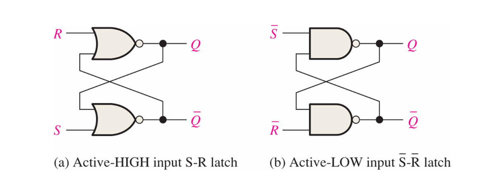

**Two Stable States: (For active-high inputs)**

1. Set State: When $S=1$ and $R=0$, the latch is set, and the output $Q$ is 1, while $\overline{Q}$ is 0.
2. Reset State: When $S=0$ and $R=1$, the latch is reset, and the output $Q$ is 0, while $\overline{Q}$ is 1.

**Indeterminate State:**
When $S=0$ and $R=0$, both outputs $Q$ and $\overline{Q}$ will remain unchanged.

**Invalid State:**
When $S=1$ and $R=1$, both outputs $Q$ and $\overline{Q}$ will be 0, which violates the principle of mutual exclusivity of the outputs. This state is considered invalid and should be avoided in practical applications.

**Truth Table:**

| $S$ | $R$ | $Q$ (Next State) | $\overline{Q}$ (Next State) |
|---|---|----------------|-----------------------------|
| 0 | 0 | Q (No Change) | $\overline{Q}$ (No Change) |
| 0 | 1 | 0              | 1                           |
| 1 | 0 | 1              | 0                           |
| 1 | 1 | Invalid        | Invalid                     |

(Truth table for active-low inputs latches:)

| $\overline{S}$ | $\overline{R}$ | $Q$ (Next State) | $\overline{Q}$ (Next State) |
|---|---|----------------|-----------------------------|
| 1 | 1 | Q (No Change) | $\overline{Q}$ (No Change) |
| 1 | 0 | 0              | 1                           |
| 0 | 1 | 1              | 0                           |
| 0 | 0 | Invalid        | Invalid                     |

The logic symbol of an S-R latch is shown below:

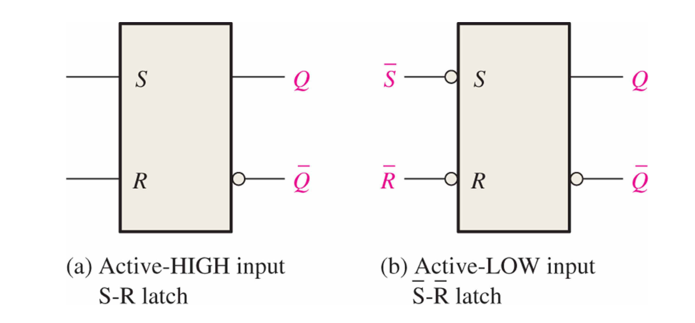

#### Variation 1: Gated S-R Latch

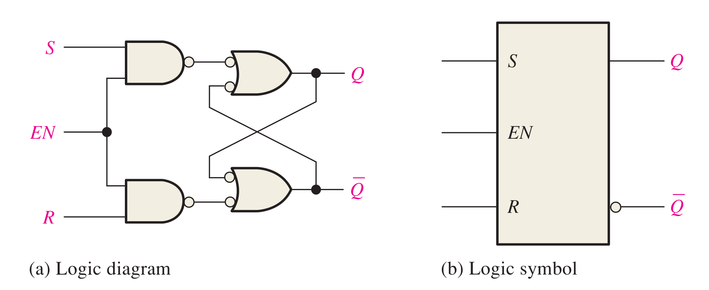

The gated S-R latch is a variation of the basic S-R latch that includes an enable input (EN). The enable input allows the latch to be controlled, so that it only responds to the S and R inputs when the enable signal is active.

Note that the Gated S-R latch shown in the figure above is an **active-high** gated S-R latch. The NAND gate at the input side translate the active-high inputs to active-low inputs for the ordinary active-low S-R latch.

**Truth Table:**

| EN | S | R | Q (Next State) | $\overline{Q}$ (Next State) |
|---|---|---|----------------|-----------------------------|
| 0 | X | X | Q (No Change) | $\overline{Q}$ (No Change) |
| 1 | 0 | 0 | Q (No Change) | $\overline{Q}$ (No Change) |
| 1 | 0 | 1 | 0              | 1                           |
| 1 | 1 | 0 | 1              | 0                           |
| 1 | 1 | 1 | Invalid        | Invalid                     |

#### Variation 2: Gated D Latch

To prevent the invalid state of the S-R latch, we can use a D latch, which has only one input (D) and an enable input (EN). The D latch ensures that the output is always valid by connecting the D input to both the S and R inputs of an S-R latch, with one of them inverted.


**Truth Table:**

| EN | D | Q (Next State) | $\overline{Q}$ (Next State) |
|---|---|----------------|-----------------------------|
| 0 | X | Q (No Change) | $\overline{Q}$ (No Change) |
| 1 | 0 | 0              | 1                           |
| 1 | 1 | 1              | 0                           |

### 7.2 Flip-Flops

A flip-flop is edge-triggered: it samples input only around a clock transition. Important timing requirements include setup time, hold time, clock-to-output delay, and maximum clock frequency. Violating setup or hold time can cause metastability, where the output temporarily fails to settle to a valid logic level.

**Flip-flops (FF)** share some structural ideas with latches, but they are edge-triggered rather than level-triggered. In other words, flip-flops sample the input data only at specific moments (rising or falling edge of the clock signal), while latches are transparent and can change their output as long as the enable signal is active.

#### Variation 1: Edge-triggered S-R FF

This kind of variation can be implemented by replacing the enable input of a gated S-R latch with a clock signal, and adding some logic gates to ensure that the S and R inputs are only sampled at the rising edge of the clock signal.

**Truth Table:**

| CLK | S | R | Q (Next State) | $\overline{Q}$ (Next State) |
|---|---|---|----------------|-----------------------------|
| 0 | X | X | Q (No Change) | $\overline{Q}$ (No Change) |
| 1 | 0 | 0 | Q (No Change) | $\overline{Q}$ (No Change) |
| 1 | 0 | 1 | 0              | 1                           |
| 1 | 1 | 0 | 1              | 0                           |
| 1 | 1 | 1 | Invalid        | Invalid                     |

*The 1 of the CLK means one edge of the clock signal, which can be either the rising edge or the falling edge, depending on the design of the flip-flop.*

The detection of the rising edge can be implemented by the propagation delay of the logic gates.

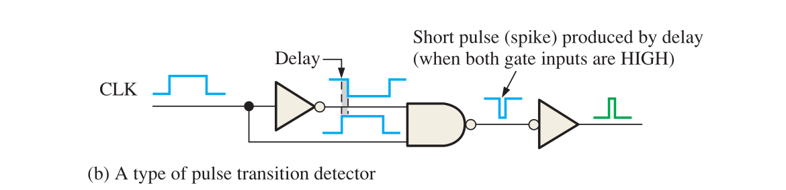

#### Variation 2: Edge-triggered D FF

This kind of variation can be implemented by replacing the enable input of a gated D latch with a clock signal, and adding some logic gates to ensure that the D input is only sampled at the rising edge of the clock signal.

#### Variation 3: Edge-triggered J-K FF

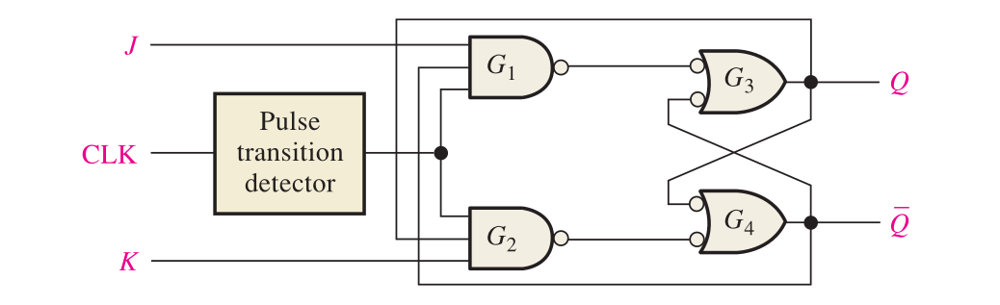

The J-K flip-flop is a versatile edge-triggered flip-flop that can be used to implement various types of sequential logic circuits. It has two inputs, J and K, and a clock input (CLK). The behavior of the J-K flip-flop is defined by the following truth table:

**Truth Table:**

| CLK | J | K | Q (Next State) | $\overline{Q}$ (Next State) |
|---|---|---|----------------|-----------------------------|
| 0 | X | X | Q (No Change) | $\overline{Q}$ (No Change) |
| 1 | 0 | 0 | Q (No Change) | $\overline{Q}$ (No Change) |
| 1 | 0 | 1 | 0              | 1                           |
| 1 | 1 | 0 | 1              | 0                           |
| 1 | 1 | 1 | $\overline{Q}$ (Toggle) | $Q$ (Toggle) |

As you can see, the J-K flip-flop **does not** have an invalid state, which makes it more reliable than the S-R FF. When both J and K are 1, the output toggles, which can be useful in certain applications such as counters and shift registers.

#### Variation 4: Async Reset and Set JK FF

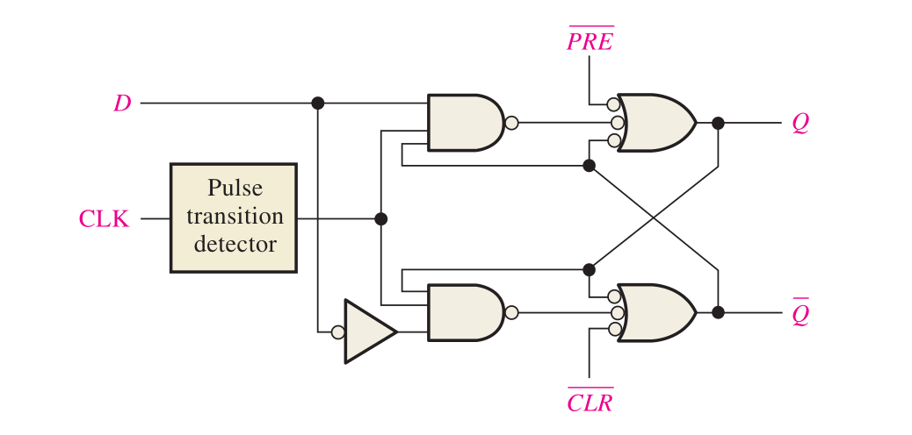

The asynchronous reset and set J-K flip-flop is a variation of the standard J-K flip-flop that includes additional inputs for asynchronous reset (R) and set (S). These inputs allow the flip-flop to be reset or set independently of the clock signal, providing more control over the state of the flip-flop.

Note that the JKFF with asynchronous reset and set shown in the figure above is an **active-high** JKFF. But the **PRE** and **CLR** inputs are active-low, which means that they will reset or set the flip-flop when they are 0.

#### Variation 5: Master-Slave JK FF

The master-slave J-K flip-flop is a variation of the standard J-K flip-flop that consists of two J-K flip-flops connected in series. The first flip-flop (the master) is triggered by the clock signal, while the second flip-flop (the slave) is triggered by the output of the master flip-flop. This configuration allows for edge-triggered operation and eliminates the possibility of race conditions, making it more reliable for certain applications.

#### Application of J-K FF: Counters

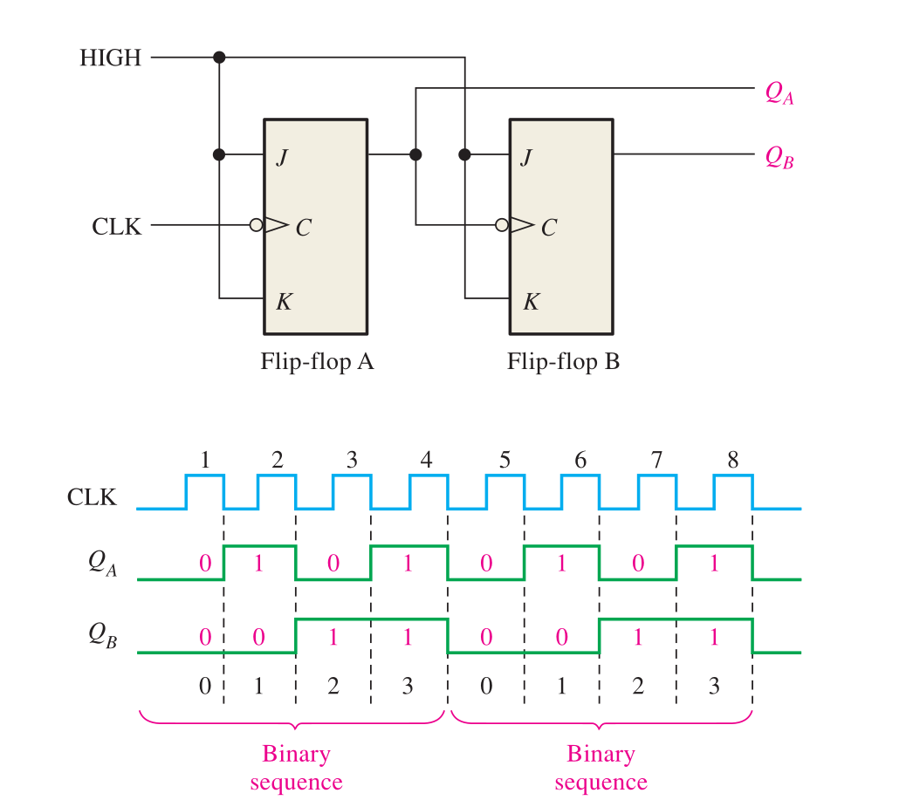

A counter is a sequential logic circuit that counts the number of clock pulses. It can be implemented using J-K flip-flops by connecting the output of one flip-flop to the clock input of the next flip-flop, and configuring the J and K inputs to toggle the state of each flip-flop on each clock pulse.

The cascade connection of J-K flip-flops allows for the creation of binary counters, which can count in binary from 0 to a maximum value determined by the number of flip-flops used. For example, a 3-bit counter can count from 0 to 7 (000 to 111 in binary) using three J-K flip-flops.

#### Schmitt Trigger

A Schmitt trigger is a type of comparator circuit that incorporates hysteresis to provide noise immunity and a clean output signal. It is commonly used in digital circuits to convert noisy or slow-changing input signals into clean, fast transitions.

- Upper Threshold Voltage ($V_{UT}$): The voltage level at which the output transitions from low to high when the input signal is rising.
- Lower Threshold Voltage ($V_{LT}$): The voltage level at which the output transitions from high to low when the input signal is falling.

Only when the input voltage exceeds the upper threshold voltage ($V_{UT}$) will the output switch to high, and only when the input voltage falls below the lower threshold voltage ($V_{LT}$) will the output switch to low. This hysteresis effect helps to prevent false triggering due to noise or slow input transitions.

### 7.3 One-Shots (Monostable Multivibrators)

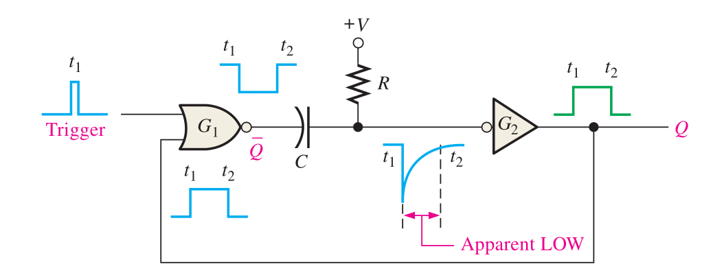

A one-shot, also known as a monostable multivibrator, is a type of sequential logic circuit that generates a single output pulse of a specified duration in response to an input trigger signal. The output pulse is generated only once for each trigger event, and the circuit returns to its stable state after the pulse is generated.

**Non-retriggerable One-Shot:**

- Once triggered, the one-shot will generate a pulse of fixed duration regardless of any additional trigger signals that may occur during the pulse duration. The one-shot will not respond to any new trigger signals until it has completed its current pulse and returned to its stable state.

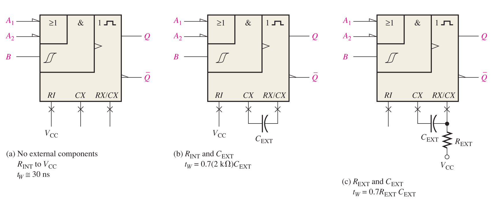

$$
t_w = RC \ln\left(\frac{V_{CC}}{V_{CC} - V_{TH}}\right) \approx 0.693 RC \approx 0.7 RC
$$

When $R$ is expressed in $\mathrm{k\Omega}$ and $C$ in $\mathrm{pF}$, $t_w$ is obtained in $\mathrm{ns}$.

### 7.4 555 Timer

The 555 timer combines analog threshold detection with digital switching behavior. Internally it uses comparators, a latch, a discharge transistor, and a resistor divider, which makes it a useful bridge between analog timing networks and digital pulses.

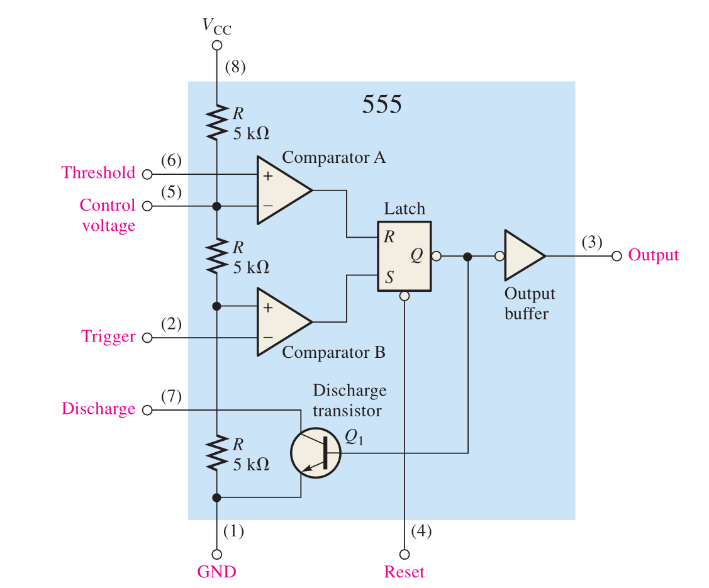

The 555 timer is a versatile integrated circuit that can be used in various applications, including timers, pulse generators, and oscillators. It can operate in three different modes: monostable mode, astable mode, and bistable mode.

**Monostable Mode:**
In monostable mode, the 555 timer functions as a one-shot pulse generator. When triggered by an input signal, it produces a single output pulse of a specified duration determined by an external resistor and capacitor.

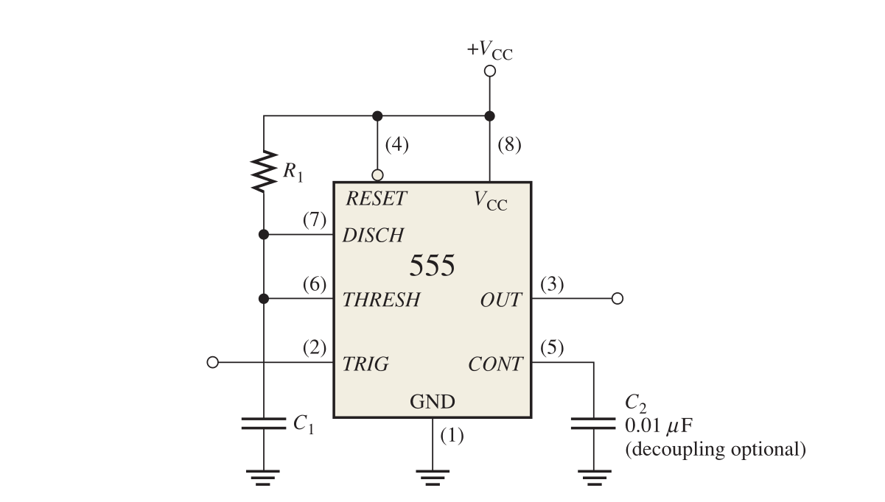

$$t_w = 1.1 R_1C_1$$

The principle is shown in the figure below:

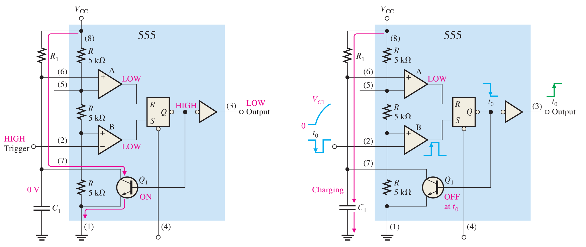

**Astable Multivibrators:**

In astable mode, the 555 timer functions as an oscillator, generating a continuous square wave output without the need for an external trigger. The frequency and duty cycle of the output waveform can be adjusted using external resistors and capacitors.

In such scenario, the 555 timer should be connected as shown in the figure below:

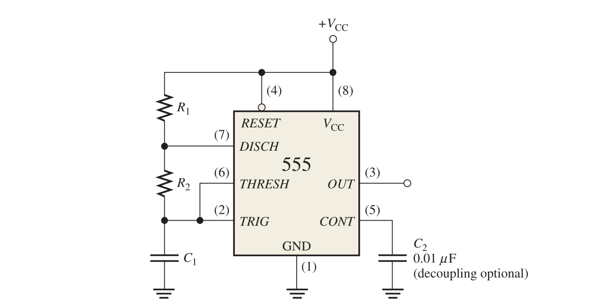

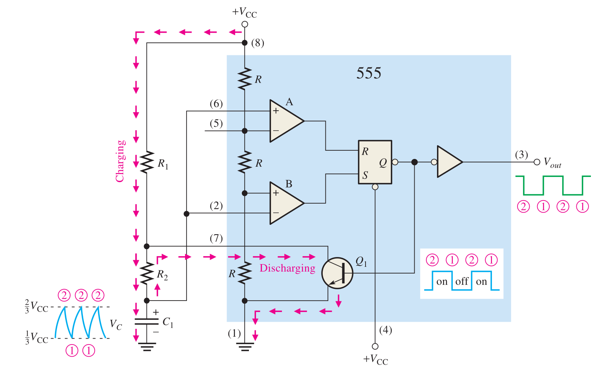

$$f = \frac{1.44}{(R_1 + 2R_2)C_1}$$

$$t_H = 0.7(R_1 + R_2)C_1, \quad t_L = 0.7 R_2 C_1$$

$$\text{Duty Cycle} = \frac{t_H}{t_H + t_L} = \frac{R_1 + R_2}{R_1 + 2R_2}$$

\begin{notebox}{Review after Chapter 7}
Check that you can distinguish latches from flip-flops, explain the invalid state of an S-R latch, describe J-K toggle behavior, and calculate basic 555 timer pulse widths or astable frequency.
\end{notebox}

## Chapter 9*: Counters

\begin{chapterbox}{Chapter focus}
Counters are sequential circuits that move through a defined state sequence. The central design question is not only what number comes next, but also how the flip-flop inputs must be driven to force that next state.
\end{chapterbox}

*Chapter 8 is outside the scope of this summary*

In previous chapters, we have already introduced the concept of counters and how to implement them using J-K flip-flops. In this chapter, we will explore different types of counters and their applications in more detail.

With respect to the previous content, we can classify counters into two categories: **Asynchronous Counters** and **Synchronous Counters**.

The counters we introduced in the previous chapter are asynchronous counters, also known as ripple counters. In an asynchronous counter, the flip-flops are not clocked simultaneously. The output of one flip-flop serves as the clock input for the next flip-flop in the sequence. This means that the counting operation ripples through the flip-flops, which can lead to propagation delays and limit the maximum counting speed.

### Synchronous Counters

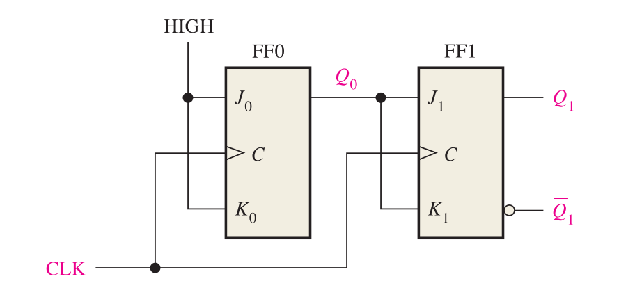

In a synchronous counter, all the flip-flops are clocked simultaneously by a common clock signal. This means that all the flip-flops change their state at the same time, which eliminates the propagation delay issue present in asynchronous counters and allows for higher counting speeds.

Note that the design of synchronous counters is to make controlled use of the propagation delay of the logic gates. In this case the small delay through the gating logic is part of the timing design rather than only a limitation, which allows the counter to operate correctly at higher frequencies.

The figure below shows the design of a 4-bit synchronous counter:

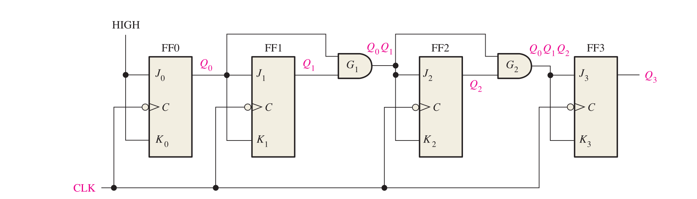

$J_0 = 1$
$J_1 = Q_0$
$J_2 = Q_0 \cdot Q_1$
$J_3 = Q_0 \cdot Q_1 \cdot Q_2$
$J_n = Q_0 \cdot Q_1 \cdot ... \cdot Q_{n-1}$

**74HC163**

*Function Table:*

| Operating Mode | $\overline{CLR}$ | $CLK$ | $ENP$ | $ENT$ | $\overline{LOAD}$ | $D$ | $Q$ | $RCO$ |
|----------------|------------------|-------|-------|-------|-------------------|---|---|---|
| Reset | 0 | 1 | X | X | X | X | 0 | 0 |
| Load | 1 | 1 | X | X | 0 | D | D | 0 |
| Count | 1 | 1 | 1 | 1 | 1 | X | Q+1 | RCO |
| Inhibit | 1 | X | 0 | X | 1 | X | Q | RCO |
| Inhibit | 1 | X | X | 0 | 1 | X | Q | 0   |

- $\overline{CLR}$: Active-low asynchronous clear input. When this input is low, the counter is reset to 0 regardless of the clock or other inputs.
- $CLK$: Clock input. The counter increments on the rising edge of the clock signal when counting is enabled.
- $ENP$: Count enable parallel input. This input must be high for the counter to increment on the clock edge.
- $ENT$: Count enable toggle input. This input must be high for the counter to increment on the clock edge.
- $\overline{LOAD}$: Active-low load input. When this input is low,
- $D$: Data inputs. These inputs are used to load a specific value into the counter when the load input is activated.

**Note that the ENP and ENT inputs are used together to enable counting. Both inputs must be high for the counter to increment on the clock edge. If either input is low, the counter will not increment and will maintain its current state.**

**74LS190**: Synchronous Up/Down Decade Counter

The $D/\overline{U}$ input determines the counting direction. When $D/\overline{U}$ is high, the counter counts down; when $D/\overline{U}$ is low, the counter counts up.

### Design a Counter

For custom counters, unused states should not be ignored. A robust design either sends unused states back into the legal sequence or ensures that they cannot be entered during normal operation.

To design a counter, we need to follow these steps:

- Determine the state diagram.
- Derive a next state table from the state diagram.
- Derive the flip-flop input equations from the next state table.
- Implement the flip-flop input equations using Karnaugh maps or Boolean algebra to simplify the logic.

**Characteristics Equation of J-K FF:**
$$Q_{\text{next}} = J \cdot \overline{Q} + \overline{K} \cdot Q$$

*Function Table of J-K FF:*
| $Q_N$ | $Q_{N+1}$ | $J$ | $K$ |
|---|---|---|---|
| 0 | 0 | 0 | X |
| 0 | 1 | 1 | X |
| 1 | 0 | X | 1 |
| 1 | 1 | X | 0 |

So using this function table, we can derive the flip-flop input equations for each flip-flop in the counter design. Then we can simplify these equations using Karnaugh maps or Boolean algebra to get the final implementation of the counter.

Here is an example of designing a 3-bit synchronous counter that counts from 0 to 7:

- State Diagram:

```text
        +---+     +---+     +---+     +---+     +---+     +---+     +---+     +---+     +---+
        |000| --> |001| --> |010| --> |011| --> |100| --> |101| --> |110| --> |111| --> |000|
        +---+     +---+     +---+     +---+     +---+     +---+     +---+     +---+     +---+
```

- Next State Table:

| Current State (Q2 Q1 Q0) | Next State (Q2' Q1' Q0') |
|---------------------------|-----------------------------|
| 000                       | 001                         |
| 001                       | 010                         |
| 010                       | 011                         |
| 011                       | 100                         |
| 100                       | 101                         |
| 101                       | 110                         |
| 110                       | 111                         |
| 111                       | 000                         |

- Flip-Flop Input Equations:

| Q2 Q1 Q0 | Q2' Q1' Q0' | J2 | K2 | J1 | K1 | J0 | K0 |
|---|---|---|---|---|---|---|---|
| 000 | 001 | 0 | X | 0 | X | 1 | X |
| 001 | 010 | 0 | X | 1 | X | X | 1 |
| 010 | 011 | 0 | X | X | 0 | 1 | X |
| 011 | 100 | 1 | X | X | 1 | X | 1 |
| 100 | 101 | X | 0 | 0 | X | 1 | X |
| 101 | 110 | X | 0 | 1 | X | X | 1 |
| 110 | 111 | X | 0 | X | 0 | 1 | X |
| 111 | 000 | X | 1 | X | 1 | X | 1 |

- Simplified Flip-Flop Input Equations:

$$J_0 = 1, \quad K_0 = 1$$

$$J_1 = Q_0, \quad K_1 = Q_0$$

$$J_2 = Q_1 \cdot Q_0, \quad K_2 = Q_1 \cdot Q_0$$

You can also simplify the equations using Karnaugh maps to get the same result. The final implementation of the counter can be done using J-K flip-flops and the derived input equations.

This is the overall process of designing a synchronous counter. The same steps can be applied to design counters with different counting sequences, such as up/down counters, decade counters, or custom sequence counters.

### Counter Cascading

When counters are cascaded, timing must be checked carefully. Synchronous cascading normally uses terminal-count or ripple-carry outputs as enable signals while keeping a common clock, which avoids accumulating ripple delay through multiple stages.

The key to cascading counters is to connect the output of one counter to the clock input of the next counter. You need to connect the clock to the CLK of both counters, and connect the **RCO/TC output of the first counter to the CTEN or ENP/ENT of the second counter**. This way, the second counter will increment its count only when the first counter reaches its maximum count and generates a carry-out signal.

## Final Review Checklist

1. Confirm the meaning of each bit pattern before doing arithmetic.
2. Check whether a signal is active-high or active-low before reading a truth table.
3. For combinational circuits, verify the truth table after simplification.
4. For sequential circuits, check setup time, hold time, propagation delay, and unused states.
5. For counters, decide whether the design is asynchronous or synchronous before analyzing timing.

## Image Attribution

Some figures in this note are taken or adapted from the book *Digital Fundamentals* by Thomas Floyd. They are included here for educational study-note purposes; all rights remain with the original author and publisher.
